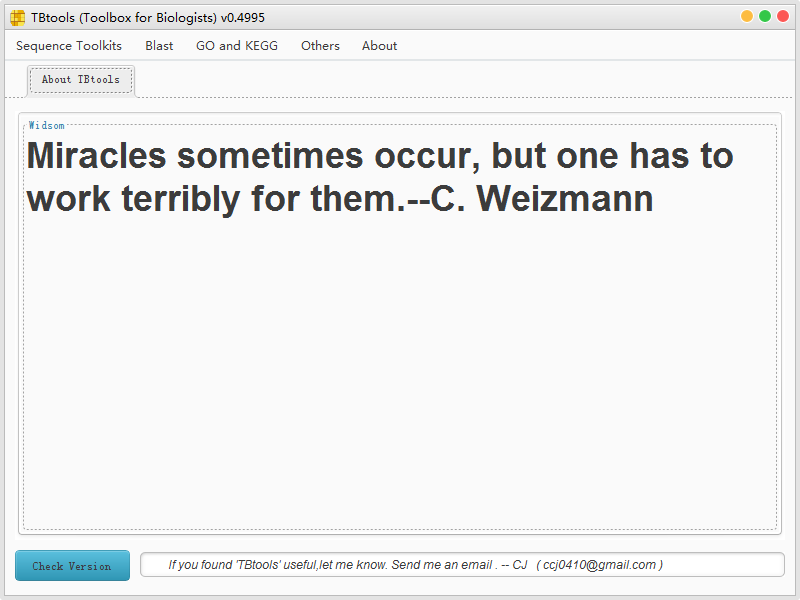

## Please Note:

TBtools is ONLY freely available for academic research. And for commercial usage, please me (ccj0410@gmail.com)
TBtools对于学术研究以及学术培训（由学术机构开设的公益性质且不收费的培训）是免费的。对于其商业用途，请通过我的邮箱联系我。
Use TBtools for fee-based Training with is included in "Commercial usage".
商业用途包括在收费的培训中使用TBtools。

## Introduction

​	TBtools is a Toolset written by CJ-Chen for wet-lab biologists. 

​	Up to now, it contains functions more than that listed HERE:

------

新增热门工具，

* **Amazing Heatmap Generator**热图工具
* **Amazing Gene Viewer**同时展示进化树，MEME结果和基因结果与结构域

序列操作工具集，Sequence Toolkits
​	

* **Fasta**序列（含区段）提取，Amazing Fasta Extractor、Fasta Extractor和Fasta Subseq
* **Fasta**序列合并和分割，Fasta Merge and Split
* **序列格式化**（序列反向、互补和按指定行宽分行），Sequence Manipulator
* **NCBI**序列批量下载，NCBI Seq DownLoader
* **cDNA**序列完成开放阅读框预测，Get Complete ORF
* ​**序列库中引物特异性检测**，Check Primers
* ​**gff3/gtf**序列提取，Gtf/Gff3 Sequences Extractor

​	
Blast界面化工具集，Blast

* ​**调用NCBI API**进行远程Blast，Remote Blast
* **少量序列Blast比对到大序列库文件**，Auto Blast SeveralSequences To a Big File
* **少量序列比对到少量序列**，Auto Blast TwoSequence Sets
* **大序列库文件比对到大序列库文件**，Auto Blast TwoSequence Sets -Big File-
* ​**序列比对到Fastq文件**，Blast Several Seq ToFastQ
* ​**互惠Blast**（用于不同序列库ID映射），Reciprocal Blast
* ​**序列比对结果区段映射图绘制**，Blast XML AlignmentShower
* ​**序列比对结果点阵图绘制**，Blast XMLDotplot
* ​**序列比对结果堆叠图绘制**，Blast XMLPileup Grapher
* ​**BlastXML结果转换为TBtools比对结果表格**，TranFormat Blast .xml to TBtools.table
* ​**BlastXML结果转换为Blast表格结果**，TranFormat Blast .xml to Blast Table
* ​**基于测序数据的电子克隆**，e-GenomeWalkingor e-Race

GeneOntology和KEGG工具集，GO and KEGG

* ​ **GO注释**，GO Anotation
* ​ **GO富集**，GO Enrichment
* ​ **GO层级统计和绘制**，GO Level Counter
* ​ **GO层级比较**，GO Level Compare
* ​ **GO注释解析**，GO Term Parser
* ​ **GO注释转换为BiNGO输入结果**，Prepare GO Annotaiton For BinGO in cytoscape
* ​ **KEGG通路富集工具**，KEGG Enrichment Analysis
* ​ **KEGG****通路差异表达基因描图工具**，KEGG Pathway Map Drawer

​	
其他工具集，Others
​	

* **取色器**，Color Picker
* ​**表格提取（行筛选）**，Table IDManipulator
* ​**表格列操作（列排序和保留）**，Table ColumnManipulator
* ​**大文本极速查看（支持.gz压缩格式）**，Big Text Viewer
* ​**大表格极速查看（支持.gz压缩格式）**，Big Table Viewer
* ​**基于标识符号提取文本区段**，Text Block Extractor
* ​**表达量快速查看/比较**，Expression Shower
* ​**读段计数做RPKM/FPKM/TPM标准化**，Expression Calculator (RPKM/FPKM/TPM)
* ​**2~6组可交互韦恩图绘制**，Wonderful Venn (Up to Six Sets)
* ​**基于序列在染色体上展示基因位置**，Map Genes OnGenome From Sequence Files
* ​**基于坐标在染色体上展示基因位置**，Map Genes OnGenome From Position Info Files
* ​**基因组共线性分析结果可视化**，Dual SystenyPlotter for MCscanX

​	
About工具，About

* ​**默认界面**（可直接拖拽.png/.jpg图片，输出Kmeans聚类色卡），About TBtools
* ​**debug对话框**，Debug Dialog
* ​**调整TBtools初始化内存**，Resize JVMmemory

​	

-----

## Compatability

​	It can run in all Operating system including Mac, Linux, Windows, which have [Java run time environment higher than 1.6](http://www.oracle.com/technetwork/java/javase/downloads/jre8-downloads-2133155.html).  Both **command line usages and GUI manipulation** have been implemented.  U can use it and distribute it **freely, for researches or for commecial purpose**. 
Well, if u found it useful to u, I will **be very graceful that u cite TBtools** in u paper...    

## List of Supporters

* **Hao Chen** from Hunan Agricultural University  
* **Kun Lu** from Southwest University  

## How to Cite TBtools

​	[TBtools, a Toolkit for Biologists integrating various HTS-data handling tools with a user-friendly interface](https://www.biorxiv.org/content/early/2018/03/27/289660)

## Dowload

[Click to download the excutable .jar file](https://github.com/CJ-Chen/TBtools/archive/master.zip)

## Current Version No.0.661

## Ad Link:https://ke.qq.com/course/311697?tuin=72ed3eb